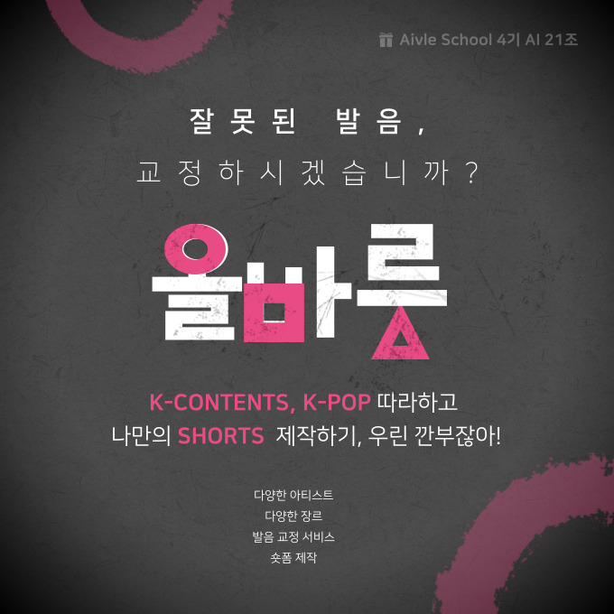
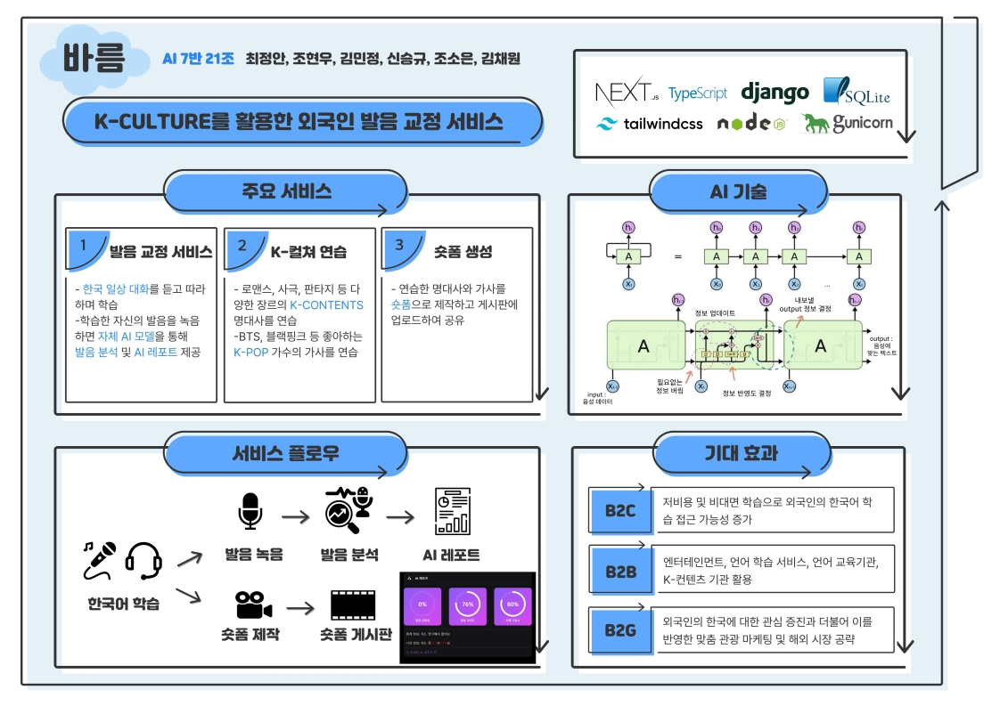

# Aivle 4기 21조 빅프로젝트 "바름" Backend 파트

   
  
   

 

## 프로젝트 소개

AivleSchool 4기 충남/충북 7반 21조 빅프로젝트

 

## 기술 스택

 

## 사용 방법

### 1. Python3.10 설치

### 2. package 설치
    pip install -r requirements.txt

### 3. dev 서버 실행
    python manage.py runserver

## 구현 기능

### 백엔드 기능 공통
- [X] Django 어드민 페이지 
- [X] API 문서화 (drf-spectacular)
- [X] CORS 보안 (화이트리스트)

### 회원가입 및 로그인
- [X] 로그인 (JWT) 
- [X] 회원가입 
- [X] Google Recaptcha V2

### 공지 게시판 및 댓글
- [X] 게시판 CRUD 
- [X] 댓글 CRUD 

### 음성녹음파일 업로드 및 AI 평가
- [X] 음성파일 업로드 
- [X] 음성파일 평가 AI 
- [X] 평가결과 저장
- [ ] AI 자동튜닝
    
### 쇼츠 게시판 및 댓글
- [X] 게시판 CRUD
- [X] 댓글 CRUD 

 

## 배운 점 & 아쉬운 점

 

## 라이센스

이 프로젝트는 Unlicense 라이선스에 따라 사용이 허가됩니다.
 이는 여러분이 이 프로젝트를 어떤 목적으로든지 제약 없이 사용할 수 있음을 의미합니다.
 자세한 내용은 [여기](http://unlicense.org)를 참조하세요.
